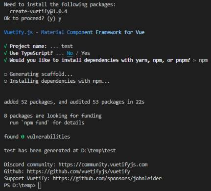
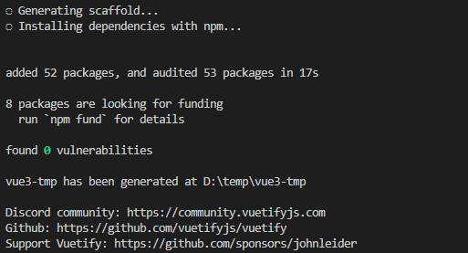
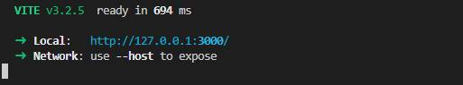
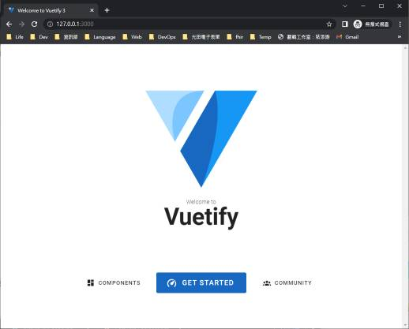
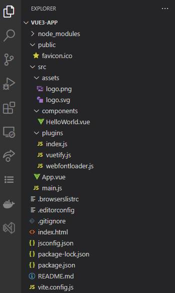

- [Create Vuetify Project](#create-vuetify-project)
	- [建立專案](#建立專案)
	- [啟動專案](#啟動專案)
	- [專案架構](#專案架構)
	- [Reference](#reference)

# Create Vuetify Project
## 建立專案
1. 輸入 ```npm create vuetify```
2. 如果提示要安裝 create-vuetify 選 **Y**。
4. 輸入**專案名稱(這裡用 vue3-app)**、Use Typescript 選 **No**、安裝程式選 **npm**。  
      
vuetify-cli 在建立完專案之後就會自動安裝套件  
    

---
## 啟動專案
1. 進入專案資料夾 
   ```bash
   cd v3-app
   ```
2. 以 VSCode 打開專案 
   ```bash
   code . 
   ```
3. ``` ctrl+` ```打開 console
4. 啟動開發伺服器
   ```bash
   npm run dev
   ```  
   結果：  
    
5. 瀏覽器打開網址 http://127.0.0.1:3000/  
    

---
## 專案架構


---
## Reference
- [Vuetify-next](https://next.vuetifyjs.com/en/getting-started/installation/)