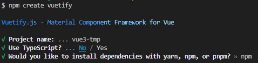

# Create Vuetify Project
## 建立專案
輸入 `npm create vuetify`
```
npm create vuetify
```
輸入`專案名稱`、Use Typescript選`No`、安裝程式選 `npm`。



## 專案架構

## 啟動專案
```
cd v3-app
code .
npm run dev
```

## Reference
- [Vuetify-next](https://next.vuetifyjs.com/en/getting-started/installation/)